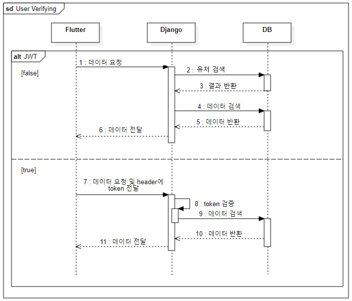

Client - Server 간에 사용자 인증을 위해 보편적으로 Cookie & Session나 토큰 인증 방식을 사용한다.  
어떤 상황에 어떤 방식을 적용하는 지 궁금하여 정보를 찾아보다 [**재미있는 글**](https://jerrynsh.com/all-to-know-about-auth-and-cookies/)을 발견했다. 위 글을 읽으며 쿠키와 세션, JWT에 대해 정리해봤다.

## 기본 지식

### HTTP 프로토콜

사용자 인증, 사용자 정보 확인이 필요한 이유는 HTTP의 프로토콜의 특징에 있다.

**connectionless** : 클라이언트가 서버에 요청을 보내면 서버는 응답을 제공하고, 그 후에는 클라이언트와 서버 간의 연결이 바로 종료된다.  
**stateless** : 서버가 클라이언트의 이전 상태를 기억하지 않는다. 즉, 서버는 요청을 받고 처리한 후 클라이언트에 대한 추가 정보를 유지하지 않는다.

stateless의 특징으로 인해 페이지 이동이나 브라우저의 재접속 시 사용자 정보가 남아있지 않게 된다.  
정적 웹페이지라면 사용자 정보를 핸들링할 필요가 없겠지만, 사용자 정보가 유지되어야 하는 경우 쿠키, 세션 등을 이용하게 된다.

### 쿠키와 세션

**쿠키** : 서버가 클라이언트로 보내는 작은 정보 조각이다. 브라우저의 Cookie Storage에 저장되며 일반적으로 authentication, _personalization_[^1], tracking에 사용된다.  
쿠키는 HttpOnly 설정을 해 JavaScript를 통한 접근을 제한할 수 있고, 이로써 XSS 공격에 대해 안전할 수 있다.
[^1]: 소비자의 이름, 관심사, 과거 구매이력을 기반으로 시장에 전달할 메시지를 조정하여 특정 고객에 맞는 마케팅 메시지를 만들어내는 것을 말한다.

**세션** : 쿠키를 기반으로 사용자 정보를 브라우저가 아닌 서버에서 관리한다. 따라서, 사용자가 많아질수록 서버의 성능저하를 유발할 수 있다.

|               | 쿠키                 | 세션                  |
| ------------- | -------------------- | --------------------- |
| 저장 위치     | 클라이언트(브라우저) | 서버                  |
| 보안          | 취약                 | 강함                  |
| 라이프 사이클 | 만료시점 시 삭제     | 브라우저 종료 시 삭제 |
| 속도          | 빠름                 | 느림                  |
| 저장 형식     | Text                 | Object                |

### XSS와 CSRF

**XXS(Cross-Site Scripting)** : Local Storage등의 Web Storage는 JavaScript를 통해 접근이 가능하다. 이 때문에 공격자가 사이트에 스크립트를 넣어 쿠키, 세션 토큰 등의 민감한 정보를 탈취할 수 있다.

**CSRF(Cross-Site Request Forgery)** : 사용자가 자신의 의지와는 무관하게 공격자가 의도한 행위(수정, 삭제, 등록 등)를 서버에 요청하게 하는 공격이다. 브라우저는 모든 request에 자동적으로 쿠키를 함께 보내기 때문에, 해당 쿠키로 주어진 접근 권한으로 브라우저를 신용하는 사이트를 공격하는 것이다.

### Storage

**Cookies Storage** : 클라이언트 저장소로 HTTP 쿠키가 저장되는 곳이다. CSRF에서 서술했지만, request를 보낼 때 `cookie request header`에 자동적으로 쿠키 포함하여 보내기 때문에 CSRF에 취약하다.

**Web Storage** : Local Storage 또는 Session Storage를 말한다. 역시 클라이언트 저장소이며, key-value 구조의 데이터를 저장하는데 이용한다. XSS공격에 취약하다. JavaScript를 통해 데이터를 가져올 수 있기 때문에 XSS에 취약하며, private/sensitive/authentication와 관련된 데이터는 저장하지 않는 것이 권장된다.

|            | Cookies Storage                    | Local/Session Storage                       |
| ---------- | ---------------------------------- | ------------------------------------------- |
| JavaScript | HttpOnly설정을 통해 접근 제한 가능 | 같은 도메인에서 JavaScript를 통해 접근 가능 |
| XSS        | 면역                               | 취약                                        |
| CSRF       | 취약                               | 면역                                        |
| 해결책     | CSRF token을 이용하거나 기타 방법  | 민감한 정보는 저장하지 않는 것이 권장       |

## JWT

JWT(JSON Web Tokens)는 토큰의 한 종류로 일반적으로 인증과 권한 부여에 이용되며, 보통 Local Storage나 Cookie에 저장된다.
토큰의 형태를 보면 암호화되어 있는 것 같지만, Base64 인코딩되어 있을 뿐이다.

### 왜 JWT를 사용하는가?

JWT를 사용하면 _horizontal scaling_[^2]이 쉬워지기에 token-based authentication에 자주 이용된다. 그 이유는 토큰의 검증에 있어 서버와 데이터베이스 간의 통신이 필요없기 때문이다.  
아래는 프로젝트에서 JWT를 적용한 예시이다.

클라이언트(Flutter)에서 데이터 요청 시 사용자 검증 후 데이터를 전달하는 로직에서, JWT를 이용하면 데이터베이스로의 I/O 없이 사용자 검증을 구현할 수 있다.

[^2]: 단일 대형 서버 대신 여러 작은 서버 또는 인스턴스로 시스템을 확장하는 기술이다. Docker와 Kubernetes가 핵심 개념 중 하나이다.

### 쿠키와의 비교는 무의미하다.

JWT는 토큰의 형식일 뿐이고, 쿠키는 HTTP 상태 관리 메커니즘([HTTP State Management Mechanism](https://www.rfc-editor.org/rfc/rfc6265))일 뿐이다.  
쿠키는 JWT를 포함할 수 있고 이는 JWT가 Cookies Storage에 저장될 수 있음을 의미한다.

## Token-based vs Session-based

올바른 비교는 "token-based 인증과 Session-based 인증의 차이는 무엇인가?" 이다.

|                | TOKEN-BASED                                   | SESSION-BASED           |
| -------------- | --------------------------------------------- | ----------------------- |
| Statefulness   | Stateless                                     | stateful                |
| 인증 상태 관리 | 서버에 저장하지 않음                          | 서버에 저장(DB)         |
| 수평적 확장    | 쉬움                                          | 어려움                  |
| 인증 방법      | 보통 JWT를 사용                               | Session ID 사용         |
| 서버 전송 방법 | HTTP Request `Authorization` Header, `Cookie` | `Cookie` request header |
| 세션 종료      | 어려움                                        | 쉬움                    |

인증과 관련된 정보를 서버에 저장하지 않아도 되고, 수평적 확장이 용이한 점 때문에 토큰 기반 인증이 선호된다.

## Bearer Tokens

Bearer token은 HTTP request의 `Authorization` header에 들어가는 토큰이다. `Authorization` header는 쿠키와는 달리 request 요청에 자동으로 포함되지 않기 때문에 CSRF 방어에 효과적이다. 그리고 토큰은 요청 시 토큰을 보내기 위해 클라이언트 측에 저장되어 있어야 한다. 하지만 Local Storage에 저장해두면 XSS에, Cookie에 저장하면 CSRF에 취약하게 된다.

## 마치며

프로그램이나 서비스의 목적에 따라 다르겠지만 최근에는 토큰 인증 방식을 많이 사용하는 것으로 보인다. 하지만 토큰 인증 방식은 보안에 취약한 부분이 있기 때문에 공격에 대한 준비가 되어 있어야 한다.
토큰을 어디에 저장하느냐는 개발자의 성향(?)과 시스템의 설계에 따라 다른 것 같다. 아래는 CSRF에 대비하는 한가지 예시이다.

---

1. 사용자가 로그인하면 서버는 JWT를 발급하고 JWT안에 `csrfToken`을 저장한다. 생성된 `csrfToken`은 예측할 수 없고 각 사용자 세션마다 고유해야 한다.

2. 그 다음 JWT는 쿠키로써 `Set-Cookie` response header 에 설정한다. 반면에 무작위로 생성된 `csrfToken`은 `X-CSRF-Token` response header에 설정된다.

3. 브라우저는 JWT를 Cookies Storage에 저장하고 `X-CSRF-Token` header에 있는 `csrfToken`은 브라우저의 Local Storage에 저장된다.

4. 요청이 일어나면(예: GET /hello), 브라우저는 Local Storage에서 `csrfToken`을 가져온다.

5. Cookies Storage의 JWT와 Local Storage에서 가져온 `csrfToken`은 request header에 담겨 서버로 보내진다.

6. 서버는 JWT를 확인하고 request header의 `csrfToken`과 JWT 안의 토큰이 일치하는 지 대조한다.

Cookies Storage와 Local Storage에 각각 토큰을 저장하여 검증하는 방식이며 공격에 대비하는 유효한 방어책이라고 생각한다. JWT의 Refresh Token까지 적절히 사용한다면 높은 수준의 보안성을 가질 수 있지 않을까?
