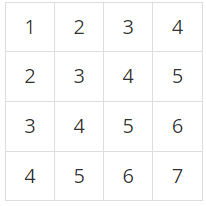

## 문제

N×N개의 수가 N×N 크기의 표에 채워져 있다. (x1, y1)부터 (x2, y2)까지 합을 구하는 프로그램을 작성하시오. (x, y)는 x행 y열을 의미한다.

예를 들어, N = 4이고, 표가 아래와 같이 채워져 있는 경우를 살펴보자.



여기서 (2, 2)부터 (3, 4)까지 합을 구하면 3+4+5+4+5+6 = 27이고, (4, 4)부터 (4, 4)까지 합을 구하면 7이다.

표에 채워져 있는 수와 합을 구하는 연산이 주어졌을 때, 이를 처리하는 프로그램을 작성하시오.

### 입력

첫째 줄에 수의 개수 N과 합을 구해야 하는 횟수 M이 주어진다. 둘째 줄에는 N개의 수가 주어진다. 수는 1,000보다 작거나 같은 자연수이다. 셋째 줄부터 M개의 줄에는 합을 구해야 하는 구간 i와 j가 주어진다.

### 출력

총 M개의 줄에 입력으로 주어진 i번째 수부터 j번째 수까지 합을 출력한다.

### 제한

- 1 ≤ N ≤ 100,000
- 1 ≤ M ≤ 100,000
- 1 ≤ i ≤ j ≤ N

## 설명

수의 개수가 크기 때문에 부분합을 미리 구해두고 구간합을 구했다.

## 코드

```python
import sys

n, cnt = map(int, sys.stdin.readline().split())
arr = [[0]*(n+1)]
arrd = [[0]*(n+1) for _ in range(n+1)] # 구간 합을 구하기 위한 2차원 배열

for i in range(n):
    A_row = [0] + [int(x) for x in sys.stdin.readline().split()]
    arr.append(A_row)

for i in range(1, n+1):
    for j in range(1, n+1):
        arrd[i][j] = arr[i][j] + arrd[i][j-1] + arrd[i-1][j] - arrd[i-1][j-1] #arr의 인덱스에 대한 구간 합

for i in range(cnt):
    x1, y1, x2, y2 = map(int, sys.stdin.readline().split())
    ans = arrd[x2][y2] - arrd[x1-1][y2] - arrd[x2][y1-1] + arrd[x1-1][y1-1] # 범위의 합을 구간 합에서 계산
    print(ans)
```
