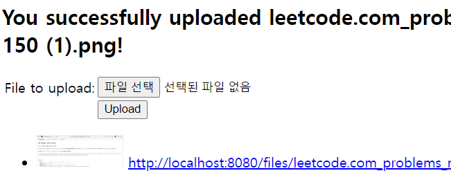
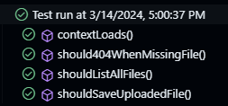

## What You Will Build

파일 업로드를 받아보고, 업로드 테스트를 위한 간단한 HTML 화면을 만들어보자.

### Create a File Upload Controller

컨트롤러를 작성하기 앞서, Controller 에서 사용할 Service의 인터페이스를 먼저 작성하자.  
이 편이 Controller를 작성할 때 메서드를 쉽게 연결할 수 있어 편하다.

**src/main/java/com/example/uploadingfiles/storage/StorageService.java**

```Java
package com.example.uploadingfiles.storage;

import org.springframework.core.io.Resource;
import org.springframework.web.multipart.MultipartFile;

import java.nio.file.Path;
import java.util.stream.Stream;

public interface StorageService {

	void init();

	void store(MultipartFile file);

	Stream<Path> loadAll();

	Path load(String filename);

	Resource loadAsResource(String filename);

	void deleteAll();

}
```

**src/main/java/com/example/uploadingfiles/FileUploadController.java**

```Java
package com.example.hellospring;

import java.io.IOException;
import java.util.stream.Collectors;

import org.springframework.core.io.Resource;
import org.springframework.http.HttpHeaders;
import org.springframework.http.ResponseEntity;
import org.springframework.stereotype.Controller;
import org.springframework.ui.Model;
import org.springframework.web.bind.annotation.ExceptionHandler;
import org.springframework.web.bind.annotation.GetMapping;
import org.springframework.web.bind.annotation.PathVariable;
import org.springframework.web.bind.annotation.PostMapping;
import org.springframework.web.bind.annotation.RequestParam;
import org.springframework.web.bind.annotation.ResponseBody;
import org.springframework.web.multipart.MultipartFile;
import org.springframework.web.servlet.mvc.method.annotation.MvcUriComponentsBuilder;
import org.springframework.web.servlet.mvc.support.RedirectAttributes;

import com.example.hellospring.storage.StorageFileNotFoundException;
import com.example.hellospring.storage.StorageService;

@Controller
public class FileUploadController {

	private final StorageService storageService;

	public FileUploadController(StorageService storageService) {
		this.storageService = storageService;
	}

	@GetMapping("/")
	public String listUploadedFiles(Model model) throws IOException {

		model.addAttribute("files", storageService.loadAll().map(
				path -> MvcUriComponentsBuilder.fromMethodName(FileUploadController.class,
						"serveFile", path.getFileName().toString()).build().toUri().toString())
				.collect(Collectors.toList()));

		return "uploadForm";
	}

	@GetMapping("/files/{filename:.+}")
	@ResponseBody
	public ResponseEntity<Resource> serveFile(@PathVariable String filename) {

		Resource file = storageService.loadAsResource(filename);

		if (file == null)
			return ResponseEntity.notFound().build();

		return ResponseEntity.ok().header(HttpHeaders.CONTENT_DISPOSITION,
				"attachment; filename=\"" + file.getFilename() + "\"").body(file);
	}

	@PostMapping("/")
	public String handleFileUpload(@RequestParam("file") MultipartFile file,
			RedirectAttributes redirectAttributes) {

		storageService.store(file);
		redirectAttributes.addFlashAttribute("message",
				"You successfully uploaded " + file.getOriginalFilename() + "!");

		return "redirect:/";
	}

	@ExceptionHandler(StorageFileNotFoundException.class)
	public ResponseEntity<?> handleStorageFileNotFound(StorageFileNotFoundException exc) {
		return ResponseEntity.notFound().build();
	}

}
```

`listUploadedFiles(Model model)` : 업로드를 위한 HTML 페이지를 보여주고, 업로드한 파일의 리스트를 가져온다.  
`serveFile(@PathVariable String filename)` : listUploadedFiles()에서 파일을 가져오기 위해 사용하는 메서드  
`handleStorageFileNotFound(StorageFileNotFoundException exc)` : Exception에 대한 핸들러이다. 핸들러 메서드는 없어도 서비스는 작동하지만 추후 작성할 테스트 코드에서 오류가 발생하며, 명시해두는 편이 좋다.

**src/main/java/com/example/uploadingfiles/storage/**

경로 안에 storage service를 위한 클래스들을 작성한다.

**StorageProperties.java**

```Java
package com.example.uploadingfiles.storage;

import org.springframework.boot.context.properties.ConfigurationProperties;

@ConfigurationProperties("storage")
public class StorageProperties {

	/**
	 * Folder location for storing files
	 */
	private String location = "upload-dir";

	public String getLocation() {
		return location;
	}

	public void setLocation(String location) {
		this.location = location;
	}

}
```

**StorageException.java**

```Java
package com.example.uploadingfiles.storage;

public class StorageException extends RuntimeException {

	public StorageException(String message) {
		super(message);
	}

	public StorageException(String message, Throwable cause) {
		super(message, cause);
	}
}
```

**StorageFileNotFoundException.java**

```Java
package com.example.uploadingfiles.storage;

public class StorageFileNotFoundException extends StorageException {

	public StorageFileNotFoundException(String message) {
		super(message);
	}

	public StorageFileNotFoundException(String message, Throwable cause) {
		super(message, cause);
	}
}
```

**FileSystemStorageService.java**

StorageService의 구현체이다.

```Java
package com.example.uploadingfiles.storage;

import java.io.IOException;
import java.io.InputStream;
import java.net.MalformedURLException;
import java.nio.file.Files;
import java.nio.file.Path;
import java.nio.file.Paths;
import java.nio.file.StandardCopyOption;
import java.util.stream.Stream;

import org.springframework.beans.factory.annotation.Autowired;
import org.springframework.core.io.Resource;
import org.springframework.core.io.UrlResource;
import org.springframework.stereotype.Service;
import org.springframework.util.FileSystemUtils;
import org.springframework.util.StringUtils;
import org.springframework.web.multipart.MultipartFile;

@Service
public class FileSystemStorageService implements StorageService {

	private final Path rootLocation;

	@Autowired
	public FileSystemStorageService(StorageProperties properties) {

        if(properties.getLocation().trim().length() == 0){
            throw new StorageException("File upload location can not be Empty.");
        }

		this.rootLocation = Paths.get(properties.getLocation());
	}

	@Override
	public void store(MultipartFile file) {
		try {
			if (file.isEmpty()) {
				throw new StorageException("Failed to store empty file.");
			}
			Path destinationFile = this.rootLocation.resolve(
					Paths.get(file.getOriginalFilename()))
					.normalize().toAbsolutePath();
			if (!destinationFile.getParent().equals(this.rootLocation.toAbsolutePath())) {

				throw new StorageException(
						"Cannot store file outside current directory.");
			}
			try (InputStream inputStream = file.getInputStream()) {
				Files.copy(inputStream, destinationFile,
					StandardCopyOption.REPLACE_EXISTING);
			}
		}
		catch (IOException e) {
			throw new StorageException("Failed to store file.", e);
		}
	}

	@Override
	public Stream<Path> loadAll() {
		try {
			return Files.walk(this.rootLocation, 1)
				.filter(path -> !path.equals(this.rootLocation))
				.map(this.rootLocation::relativize);
		}
		catch (IOException e) {
			throw new StorageException("Failed to read stored files", e);
		}

	}

	@Override
	public Path load(String filename) {
		return rootLocation.resolve(filename);
	}

	@Override
	public Resource loadAsResource(String filename) {
		try {
			Path file = load(filename);
			Resource resource = new UrlResource(file.toUri());
			if (resource.exists() || resource.isReadable()) {
				return resource;
			}
			else {
				throw new StorageFileNotFoundException(
						"Could not read file: " + filename);

			}
		}
		catch (MalformedURLException e) {
			throw new StorageFileNotFoundException("Could not read file: " + filename, e);
		}
	}

	@Override
	public void deleteAll() {
		FileSystemUtils.deleteRecursively(rootLocation.toFile());
	}

	@Override
	public void init() {
		try {
			Files.createDirectories(rootLocation);
		}
		catch (IOException e) {
			throw new StorageException("Could not initialize storage", e);
		}
	}
}
```

### Creating an HTML Template

**src/main/resources/templates/uploadForm.html**

```Java
<html xmlns:th="https://www.thymeleaf.org">
<body>

	<div th:if="${message}">
		<h2 th:text="${message}"/>
	</div>

	<div>
		<form method="POST" enctype="multipart/form-data" action="/">
			<table>
				<tr><td>File to upload:</td><td><input type="file" name="file" /></td></tr>
				<tr><td></td><td><input type="submit" value="Upload" /></td></tr>
			</table>
		</form>
	</div>

	<div>
		<ul>
			<li th:each="file : ${files}">
				<a th:href="${file}" th:text="${file}" />
			</li>
		</ul>
	</div>

</body>
</html>
```

### Tuning File Upload Limits

**src/main/resources/application.properties**

```properties
spring.servlet.multipart.max-file-size=128KB
spring.servlet.multipart.max-request-size=128KB
```

### Update the Application

**src/main/java/com/example/uploadingfiles/UploadingFilesApplication.java**

```Java
package com.example.uploadingfiles;

import org.springframework.boot.CommandLineRunner;
import org.springframework.boot.SpringApplication;
import org.springframework.boot.autoconfigure.SpringBootApplication;
import org.springframework.boot.context.properties.EnableConfigurationProperties;
import org.springframework.context.annotation.Bean;

import com.example.uploadingfiles.storage.StorageProperties;
import com.example.uploadingfiles.storage.StorageService;

@SpringBootApplication
@EnableConfigurationProperties(StorageProperties.class)
public class UploadingFilesApplication {

	public static void main(String[] args) {
		SpringApplication.run(UploadingFilesApplication.class, args);
	}

	@Bean
	CommandLineRunner init(StorageService storageService) {
		return (args) -> {
			storageService.deleteAll();
			storageService.init();
		};
	}
}
```

### 결과



나는 이미지도 미리보기 위해 HTML파일을 살짝 수정했다.  
파일이 정상적으로 저장되는 것을 볼 수 있다.

## Testing Your Application

_`MockMvc`_[^1]를 이용하여 _servlet container_[^2]를 실행하지 않고 테스트를 수행할 수 있다.
[^1]: HTTP 요청 및 응답을 모의(mock)로 처리하여 서버를 실행하지 않고도 컨트롤러 및 REST 엔드포인트를 테스트할 수 있게 해준다.
[^2]: 서블릿의 라이프사이클을 관리하고 HTTP 요청을 받아들이며, 서블릿 코드의 실행을 처리하고 그 결과를 클라이언트에게 반환. Apache Tomcat, Jetty, IBM WebSphere 등이 있다.

**src/test/java/com/example/uploadingfiles/FileUploadTests.java**

```Java
package com.example.uploadingfiles;

import java.nio.file.Paths;
import java.util.stream.Stream;

import org.hamcrest.Matchers;
import org.junit.jupiter.api.Test;

import org.springframework.beans.factory.annotation.Autowired;
import org.springframework.boot.test.autoconfigure.web.servlet.AutoConfigureMockMvc;
import org.springframework.boot.test.context.SpringBootTest;
import org.springframework.boot.test.mock.mockito.MockBean;
import org.springframework.mock.web.MockMultipartFile;
import org.springframework.test.web.servlet.MockMvc;

import static org.mockito.BDDMockito.given;
import static org.mockito.BDDMockito.then;
import static org.springframework.test.web.servlet.request.MockMvcRequestBuilders.get;
import static org.springframework.test.web.servlet.request.MockMvcRequestBuilders.multipart;
import static org.springframework.test.web.servlet.result.MockMvcResultMatchers.header;
import static org.springframework.test.web.servlet.result.MockMvcResultMatchers.model;
import static org.springframework.test.web.servlet.result.MockMvcResultMatchers.status;

import com.example.uploadingfiles.storage.StorageFileNotFoundException;
import com.example.uploadingfiles.storage.StorageService;

@AutoConfigureMockMvc
@SpringBootTest
public class FileUploadTests {

	@Autowired
	private MockMvc mvc;

	@MockBean
	private StorageService storageService;

	@Test
	public void shouldListAllFiles() throws Exception {
		given(this.storageService.loadAll())
				.willReturn(Stream.of(Paths.get("first.txt"), Paths.get("second.txt")));

		this.mvc.perform(get("/")).andExpect(status().isOk())
				.andExpect(model().attribute("files",
						Matchers.contains("http://localhost/files/first.txt",
								"http://localhost/files/second.txt")));
	}

	@Test
	public void shouldSaveUploadedFile() throws Exception {
		MockMultipartFile multipartFile = new MockMultipartFile("file", "test.txt",
				"text/plain", "Spring Framework".getBytes());
		this.mvc.perform(multipart("/").file(multipartFile))
				.andExpect(status().isFound())
				.andExpect(header().string("Location", "/"));

		then(this.storageService).should().store(multipartFile);
	}

	@SuppressWarnings("unchecked")
	@Test
	public void should404WhenMissingFile() throws Exception {
		given(this.storageService.loadAsResource("test.txt"))
				.willThrow(StorageFileNotFoundException.class);

		this.mvc.perform(get("/files/test.txt")).andExpect(status().isNotFound());
	}

}
```

### 결과



테스트 시 Spring을 시작하지 않기 때문에 빠르게 테스트할 수 있다.
