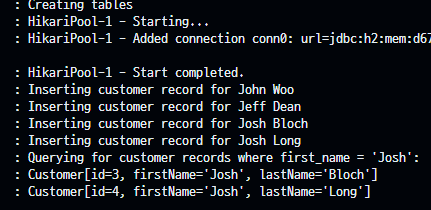

## What You Will Build

`JdbcTemplate`를 사용하여 관계형 데이터베이스에 접근하기

## Initial

프로젝트를 생성하며 JDBC API와 H2 Database의 Dependencies를 추가하거나, build.grade에서 직접 추가한다.

```gradle
dependencies {
	implementation 'org.springframework.boot:spring-boot-starter-web'
	compileOnly 'org.projectlombok:lombok'
	annotationProcessor 'org.projectlombok:lombok'
	testImplementation 'org.springframework.boot:spring-boot-starter-test'
	implementation 'org.springframework.boot:spring-boot-starter-jdbc' //new
	runtimeOnly 'com.h2database:h2' //new
}
```

## Create a Customer Object

**src/main/java/com/example/relationaldataaccess/Customer.java**

```Java
package com.example.relationaldataaccess;

public class Customer {
  private long id;
  private String firstName, lastName;

  public Customer(long id, String firstName, String lastName) {
    this.id = id;
    this.firstName = firstName;
    this.lastName = lastName;
  }

  @Override
  public String toString() {
    return String.format(
        "Customer[id=%d, firstName='%s', lastName='%s']",
        id, firstName, lastName);
  }

  // getters & setters는 간략화를 위해 생략
}
```

## Store and Retrieve Data

Spring은 SQL 관계형 데이터베이스와 JDBC를 사용하기 쉽게 해주는 JdbcTemplate이라는 템플릿 클래스를 제공한다.  
JdbcTemplate는 리소스 획득, 연결 관리, 예외 처리 및 코드의 목적과는 전혀 관련이 없는 일반적인 오류 확인 등을 대신 처리해준다.

**src/main/java/com/example/relationaldataaccess/RelationalDataAccessApplication.java**

```Java
package com.example.relationaldataaccess;

import org.slf4j.Logger;
import org.slf4j.LoggerFactory;
import org.springframework.beans.factory.annotation.Autowired;
import org.springframework.boot.CommandLineRunner;
import org.springframework.boot.SpringApplication;
import org.springframework.boot.autoconfigure.SpringBootApplication;
import org.springframework.jdbc.core.JdbcTemplate;

import java.util.Arrays;
import java.util.List;
import java.util.stream.Collectors;

@SpringBootApplication
public class RelationalDataAccessApplication implements CommandLineRunner {

  private static final Logger log = LoggerFactory.getLogger(RelationalDataAccessApplication.class);

  public static void main(String args[]) {
    SpringApplication.run(RelationalDataAccessApplication.class, args);
  }

  @Autowired
  JdbcTemplate jdbcTemplate;

  @Override
  public void run(String... strings) throws Exception {

    log.info("Creating tables");

    jdbcTemplate.execute("DROP TABLE customers IF EXISTS");
    jdbcTemplate.execute("CREATE TABLE customers(" +
        "id SERIAL, first_name VARCHAR(255), last_name VARCHAR(255))");

    List<Object[]> splitUpNames = Arrays.asList("John Woo", "Jeff Dean", "Josh Bloch", "Josh Long").stream()
        .map(name -> name.split(" "))
        .collect(Collectors.toList());

    splitUpNames.forEach(name -> log.info(String.format("Inserting customer record for %s %s", name[0], name[1])));

    jdbcTemplate.batchUpdate("INSERT INTO customers(first_name, last_name) VALUES (?,?)", splitUpNames);

    log.info("Querying for customer records where first_name = 'Josh':");
    jdbcTemplate.query(
        "SELECT id, first_name, last_name FROM customers WHERE first_name = ?",
        (rs, rowNum) -> new Customer(rs.getLong("id"), rs.getString("first_name"), rs.getString("last_name")), "Josh")
    .forEach(customer -> log.info(customer.toString()));
  }
}
```

Spring Boot는 H2(인메모리 관계형 데이터베이스 엔진)를 지원하며 자동으로 연결을 생성한다.  
현재는 spring-jdbc를 사용하기 때문에, Spring Boot는 자동으로 JdbcTemplate을 생성한다.

1. `String... strings`는 임의의 개수의 문자열을 매개변수로 받음을 의미
2. 여러 insert문을 이용한다면 `batchUpdate`사용, 단일이라면 `insert`
3. arguments에 `?`를 이용하여 SQL injection 공격을 피할 수 있음

## 결과


