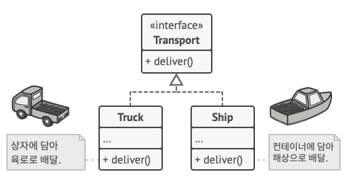

## 의도

부모 클래스에서 객체들을 생성할 수 있는 인터페이스를 제공해 자식 클래스들이 생성될 객체들의 유형을 변경할 수 있도록 하는 생성 패턴

## 문제

1. 물류 관리 앱을 개발하고 있다고 가정.  
   앱의 첫 번째 버전은 트럭 운송만 처리할 수 있어서 대부분의 코드가 Truck​(트럭) 클래스에 존재.
2. 해상 물류 기능을 앱에 추가해 달라는 요청 발생
3. 앱에 Ship​(선박) 클래스를 추가하려면 전체 코드 베이스를 변경해야 함.

## 해결책

객체 생성 직접 호출들을 팩토리 메서드에 대한 호출들로 대체.  
자식 클래스에서 팩토리 메서드를 오버라이딩하여 그 메서드에 의해 생성되는 제품들의 클래스를 변경할 수 있게 됨.

단, 공통 기초 클래스 또는 공통 인터페이스를 두어야 함.

## 구조

## 적용 상황

- **함께 작동해야 하는 객체들의 정확한 유형들과 의존관계들을 미리 모르는 경우**  
  제품 생성 코드를 제품을 실제로 사용하는 코드와 분리하기에 독립적으로 확장하기 쉬워진다.  
  예를 들어, 앱에 새로운 제품을 추가하려면 새로운 크리에이터 자식 클래스를 생성한 후 해당 클래스 내부의 팩토리 메서드를 오버라이딩​(재정의)​하기만 하면 된다.

- **라이브러리 또는 프레임워크의 사용자들에게 내부 컴포넌트들을 확장하는 방법을 제공하고 싶을 때**  
  프레임워크 전체에서 컴포넌트들을 생성하는 코드를 단일 팩토리 메서드로 줄인 후, 누구나 이 팩토리 메서드를 오버라이드 할 수 있도록 만들 수 있다.

- **기존 객체들을 매번 재구축하는 대신 이들을 재사용하여 시스템 리소스를 절약하고 싶을 때**  
  데이터베이스 연결, 파일 시스템 및 네트워크처럼 시스템 자원을 많이 사용하는 대규모 객체들을 처리할 때 자주 발생한다.

## 장단점

**장점**

- 크리에이터와 구상 제품들이 단단하게 결합되지 않도록 할 수 있다.
- 단일 책임 원칙. 제품 생성 코드를 프로그램의 한 위치로 이동하여 코드를 더 쉽게 유지관리할 수 있다.
- 개방/폐쇄 원칙. 당신은 기존 클라이언트 코드를 훼손하지 않고 새로운 유형의 제품들을 프로그램에 도입할 수 있다.

**단점**

- 패턴을 구현하기 위해 많은 새로운 자식 클래스들을 도입해야 하므로 코드가 더 복잡해질 수 있다.
